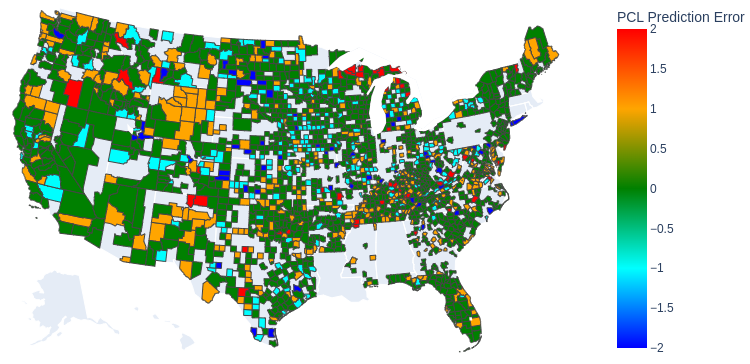

# Property Crime by US County

Several supervised learning models are tuned and compared in the jupyter notebook. The goal is to predict the property crime level for a given county.
The features include:
- average annual temperature
- total annual precipitation
- employment rate
- per capita personal income
- population fractions by age, gender, race, ethnicity.

The model was trained on 2018 data and tested on 2019 data. Please see the notebook or slides for sources.

It should be noted that machine learning models incorporate bias based on the features they are fed.
The final model presented here thus has racial and ethnic bias and is not recommended outside of personal or academic use.
If you do use it to estimate the crime level reported by a county, don't let it be a sole factor in any decision you make.

Model types:
- Logistic Regression
- Random Forest Classifier
- Gradient Boosting Classifier
- Support Vector Classifier

The random forest model has the best mix of performance, speed, and insight for this set of data.
Considerable cleaning and standardization was required before training.

